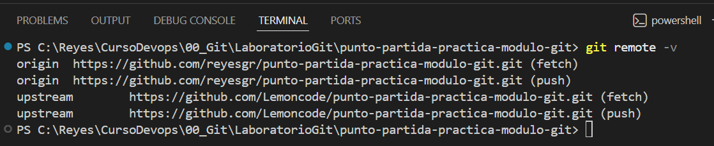
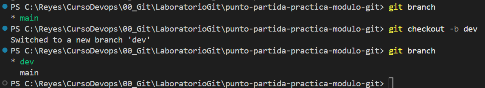
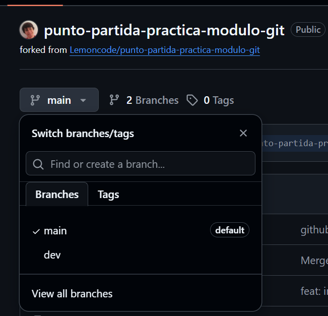
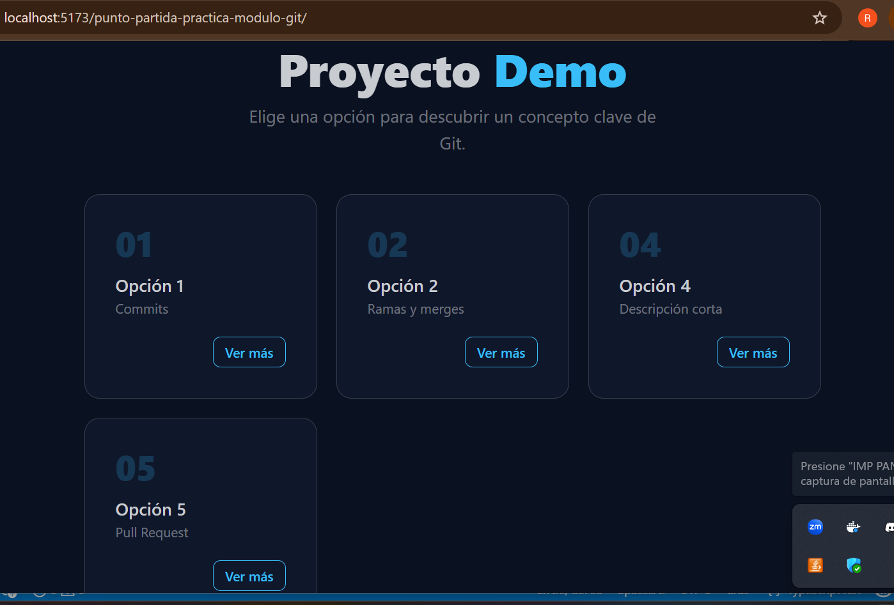
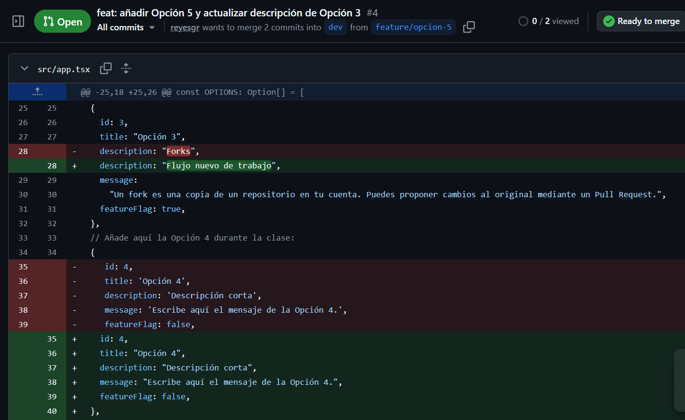
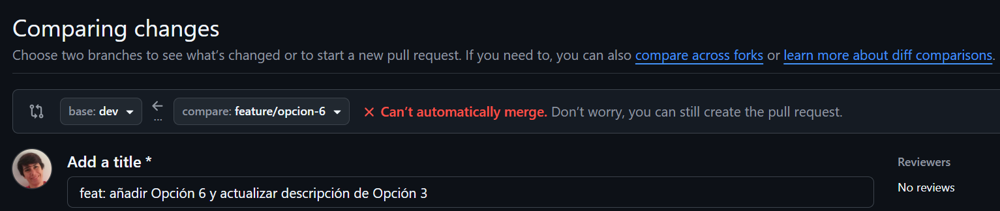
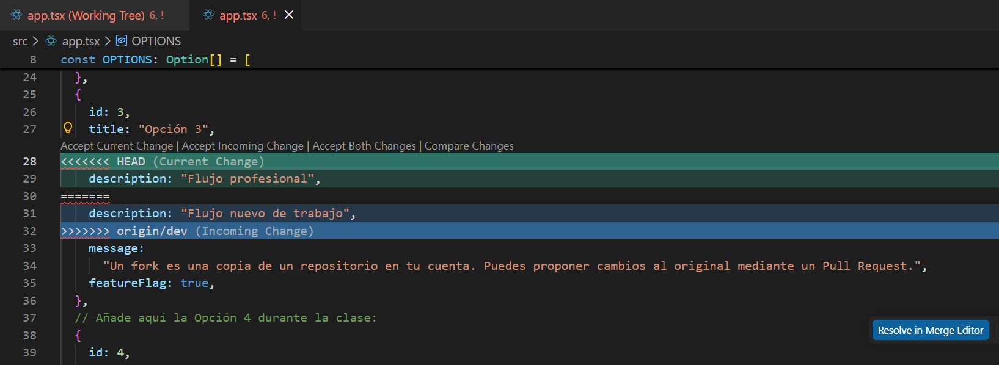
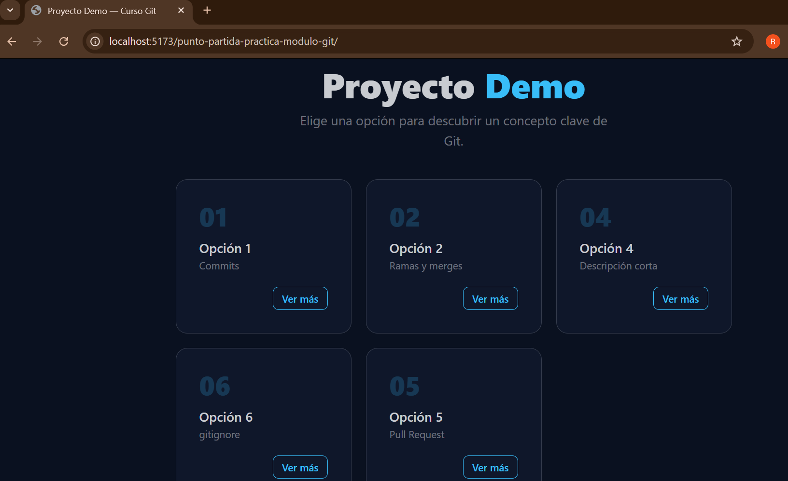

# Git Lab

## Tarea 1 — Fork y configuración inicial
Un fork es una copia que se hace de un proyecto, aunque no es una copia totalmente independiente. La idea del fork es mantener una relación con el proyecto desde el que se hizo la copia. De esa forma, si hay un cambio en el proyecto original puedes aplicar dichos cambios a tu copia para mantenerla actualizada.
Una vez hecho el fork del proyecto en el GitHub y para trabajar con VSCode, he clonado el repositorio con: git clone https://github.com/reyesgr/punto-partida-practica-modulo-git.git

También se pueden hacer cambios en la otra dirección, se puede proponer que los cambios en tu copia del proyecto se apliquen al proyecto original. En git para interactuar con el proyecto original se configura su dirección como upstream . Cuando se hace un pull de upstream, te traes los cambios que se hicieron en el proyecto original desde que creaste el fork (o desde que hiciste el último pull de upstream).
Para configurar dicha dirección como upstream he usado el comando: git remote add upstream https://github.com/Lemoncode/punto-partida-practica-modulo-git.git

Así pues mi proyecto queda de la forma:

*Terminal con git remote -v mostrando origin y upstream*

*Terminal con la creación de la rama dev*

*GitHub con la rama dev visible en el desplegable de ramas*

## Tarea 2 — Feature branch A: añadir la Opción 5
La rama parte de dev porque para agregar nuevas funcionalidades y es mejor trabajar en una rama nueva manteneniendo el main limpio y estable. 

Para ver las ramas que tengo y en la que estoy puedo hacer *git branch* o *git switch dev*. Para crear la nueva rama y cambiar a ella hago *git switch -c feature/opcion-5*.

Tras modificar el fichero src/app.tsx en la nueva rama he lanzado la app realizando npm install y npm run dev. Veo la nueva versión de la app en local (http://localhost:5173/punto-partida-practica-modulo-git/)

*La app en el navegador con la Opción 5 recién añadida*

A continuación, realizo un commit de app.tsx y del package-lock.json con el comentario *feat: añadir Opción 5 y actualizar descripción de Opción 3*. Después subo la rama a mi fork con *git push -u origin feature/opcion-5*

## Tarea 3 — Feature branch B: añadir la Opción 6 (aquí está el conflicto)
Un conflicto en Git ocurre cuando Git no sabe cómo combinar cambios realizados en dos ramas distintas.
En nuestro caso los cambios de feature/opcion-5 y feature/opcion-6 incluyen una modificación de la descripción de la opción 3. Ambos parten de dev, y lo modifican. Git no sabe qué cambio es el que preferimos.

Para volver a dev usamos el comando *git switch dev*; creo la nueva rama con *git switch -c feature/opcion-6*; realizo un commit de app.tsx con el comentario *feat: añadir Opción 6 y actualizar descripción de Opción 3*. Después subo la rama a mi fork con *git push -u origin feature/opcion-6*

## Tarea 4 — Pull Request 1: Feature A a dev
En la pestaña Files changed del Pull Request revisé los cambios realizados en el archivos app.tsx. Ahí se pueden ver las líneas añadidas en verde y las eliminadas o modificadas en rojo.

Revisar esta pestaña antes de hacer el merge es útil porque ayuda a detectar errores antes de integrar el código,
permite revisar exactamente qué se va a incorporar a la rama principal,
facilita la revisión entre compañeros o equipos y evita subir cambios innecesarios o incorrectos al proyecto.

*El PR de Feature A en GitHub con la pestaña Files changed abierta*

## Tarea 5 — Pull Request 2: Feature B a dev, conflicto

*El PR de Feature B en GitHub mostrando el banner rojo de conflicto*

*Los marcadores de conflicto (<<<<<<<, =======, >>>>>>>) en VS Code*

En VSCode, los marcadores dan información sobre el conflicto:
- <<<<< indica el inicio del conflicto, primero indica el contenido de la rama en la que estás situado. Es el cambio actual
- ====== es el divisor entre los cambios, es un separador.
- \>\>\>\>\>\> indica el Incoming Change , los cambios en la rama que estás intentando fusionar.

*La app en el navegador con todas las opciones visibles tras resolver el conflicto*

## Tarea 6 — Limpieza y cierre del diario

*Terminal con git log --oneline en main mostrando todos los commits*

